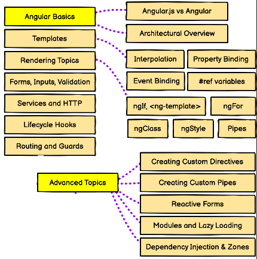
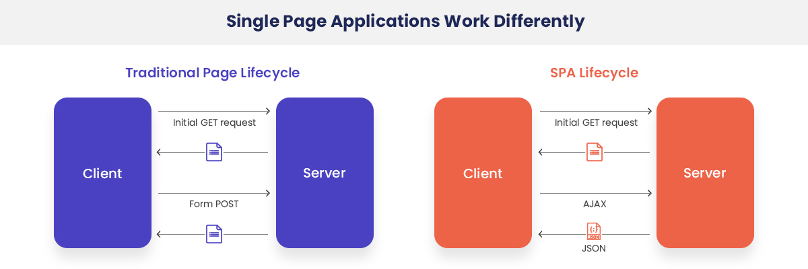
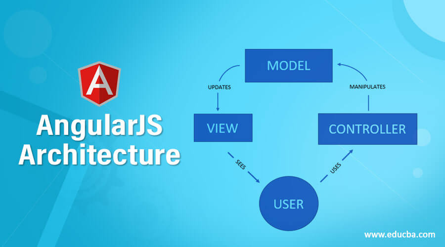
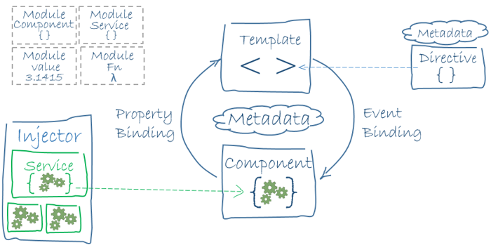

### Basic About Angular . . .

---

####  Road map for Angular Beginners

  >> [](images/angular_road_map.png)


<br />

- What is Angular?
    > Angular is a Typescript-based open-source framework for building client-side web applications developed and supported by Google.
    
    > Angular is a client-side JavaScript framework that was specifically designed to help developers build SPAs (Single Page Applications) in accordance with best practices for web development.

    > Single-Page Applications (or SPA’s) are applications that are accessed via a web browser like other websites but offer more dynamic interactions resembling native mobile and desktop apps. The most notable difference between a regular website and SPA is the reduced amount of page refreshes. SPAs have a heavier usage of AJAX- a way to communicate with back-end servers without doing a full page refresh to get data loaded into our application. As a result, the process of rendering pages happens mostly on the client-side.

  > 
  
  <br />

  > [](images/angular_architecture.png)

  <br />

- Angular Features
  > - CROSS PLATFORM
  > - SPEED AND PERFORMANCE
  > - PRODUCTIVITY
  > - FULL DEVELOPMENT STORY

<br />

- Environment Setup for Angular
  > Install the node package manager and check version using ```node -v``` to check node js version and ```npm -v``` to check the npm version. For reference [Click Here](https://nodejs.org/en/download/)

  > Install angular cli using ```npm install -g @angular/cli``` or you can install specific version of angular cli using ```npm install -g @angular/cli@ANGULAR_VERSION_HERE```.
  
  > Check angular version using ```ng --version```.

<br />

- Create Your First Angular Application & Run
  > To create your angular application: ```ng new PROJECT_NAME_HERE```.
  > Now switch into your project directory by using ```cd PROJECT_NAME_HERE``` and run the command: ```ng serve```.
  > After your project run successful it will open at url [https://localhost:4200](https://localhost:4200/).

<br />

- Building Blocks of Angular
  > - Modules 
  > - Components
  > - Templates
  > - Metadata
  > - Pipes
  > - Data binding
  > - Directives
  > - Services
  > - Dependency injection

  > [](images/angular_building_blocks.png)

<br />

- Continue . . .
